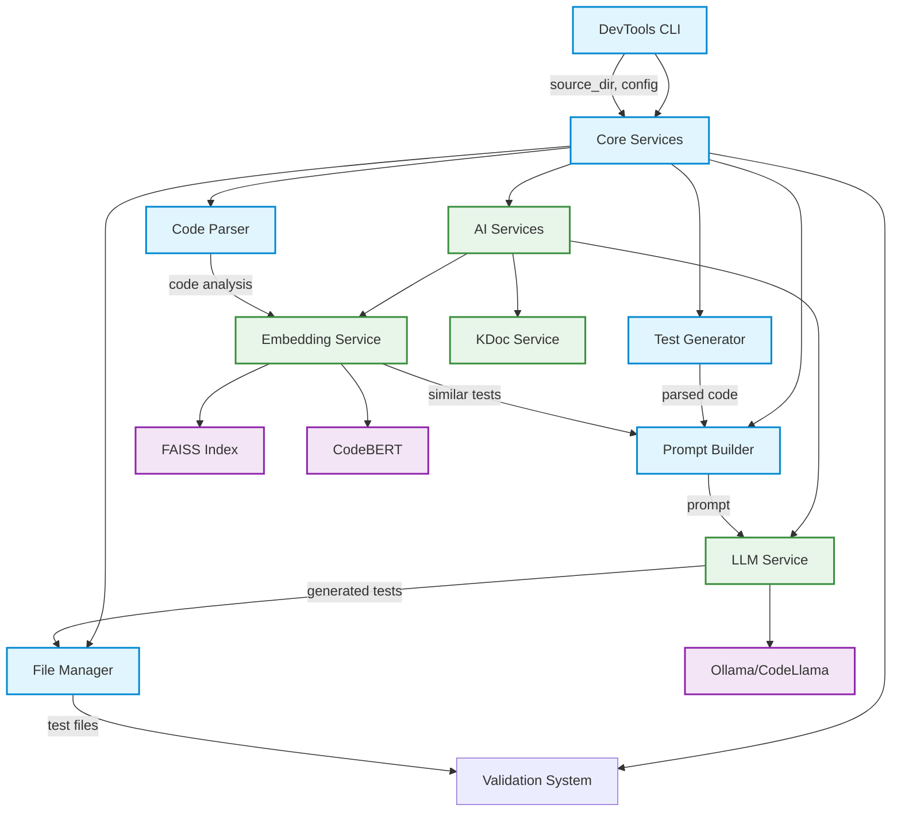
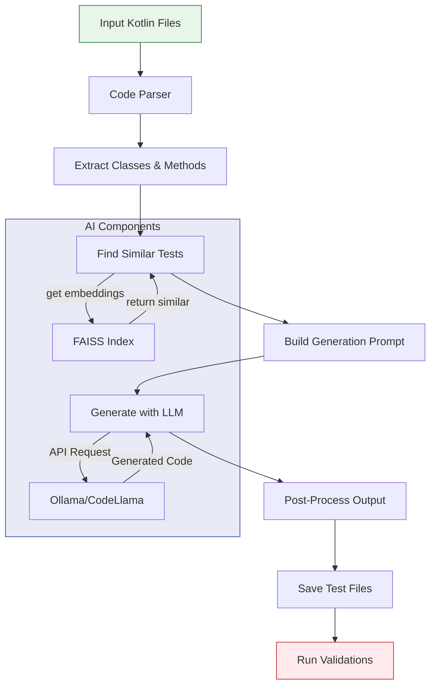
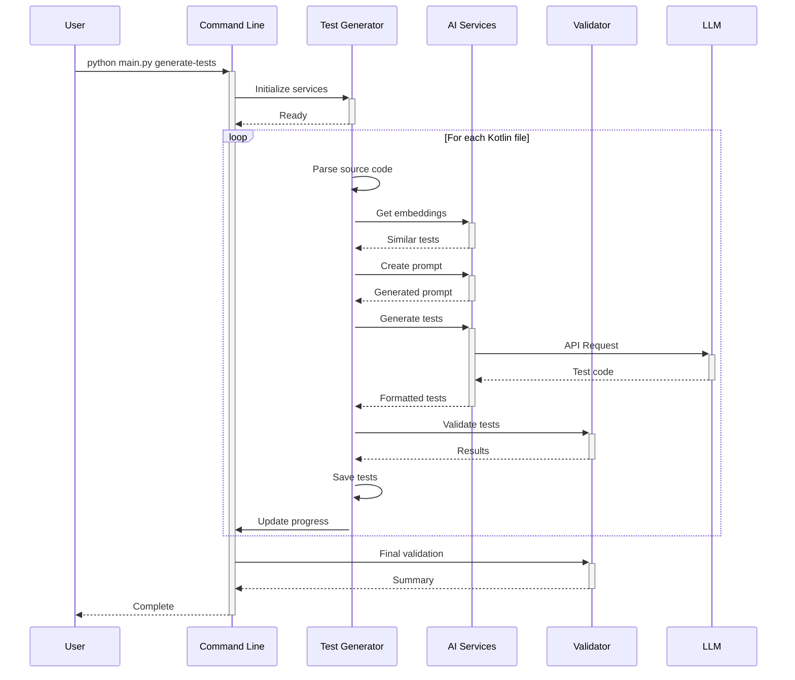
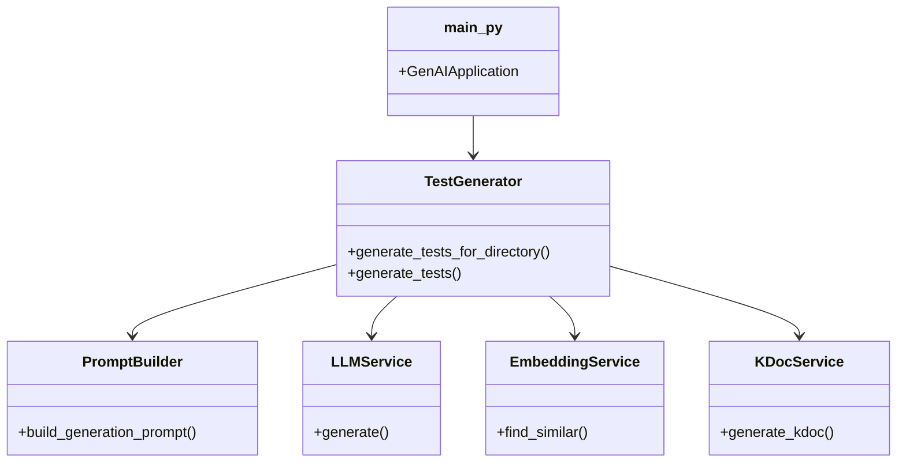

# System Architecture & Data Flow Diagrams

This document provides visual representations of the Kotlin Test Generation System's architecture and data flows using Mermaid diagrams.

## System Architecture Overview



## Data Flow - Test Generation Process



## Sequence Diagram - Test Generation



## Component Interaction

```mermaid
graph LR
    subgraph Core[Core Components]
        TG[TestGenerator]
        PB[PromptBuilder]
        LS[LLM Service]
        ES[Embedding Service]
        
        TG -->|uses| PB
        TG -->|manages| LS
        TG -->|queries| ES
    end
    
    subgraph Support[Support Services]
        CM[Config Manager]
        LOG[Logger]
        FM[File Manager]
        
        CM -->|configures| TG
        LOG -->|logs| TG
        FM -->|handles I/O| TG
    end
    
    subgraph Ext[External]
        OL[Ollama]
        FS[FAISS]
        CB[CodeBERT]
        
        OL -->|powers| LS
        FS -->|indexes| ES
        CB -->|embeds| ES
    end
    
    style Core fill:#e1f5fe,stroke:#0288d1
    style Support fill:#e8f5e9,stroke:#2e7d32
    style Ext fill:#f3e5f5,stroke:#8e24aa
        TestGen->>LLM: generate(prompt)
        LLM-->>TestGen: test code
        TestGen->>TestGen: clean_generated_code()
        TestGen->>File: save test file
    end
    TestGen-->>CLI: results
    CLI-->>User: summary
```

## Component Relationships



---

*Last updated: July 2025. For more, see API and ARCHITECTURE docs.*
