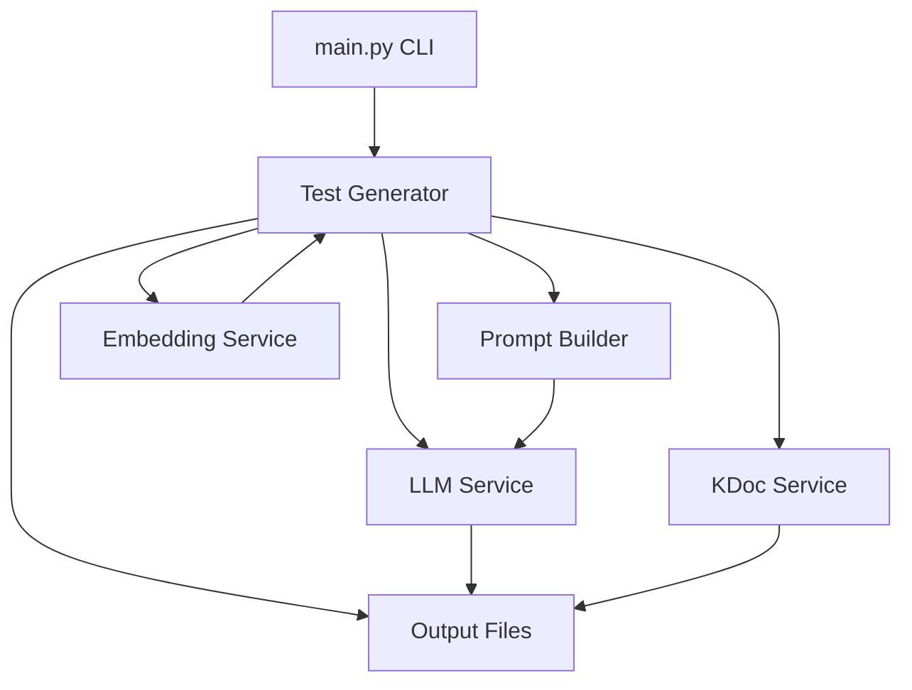
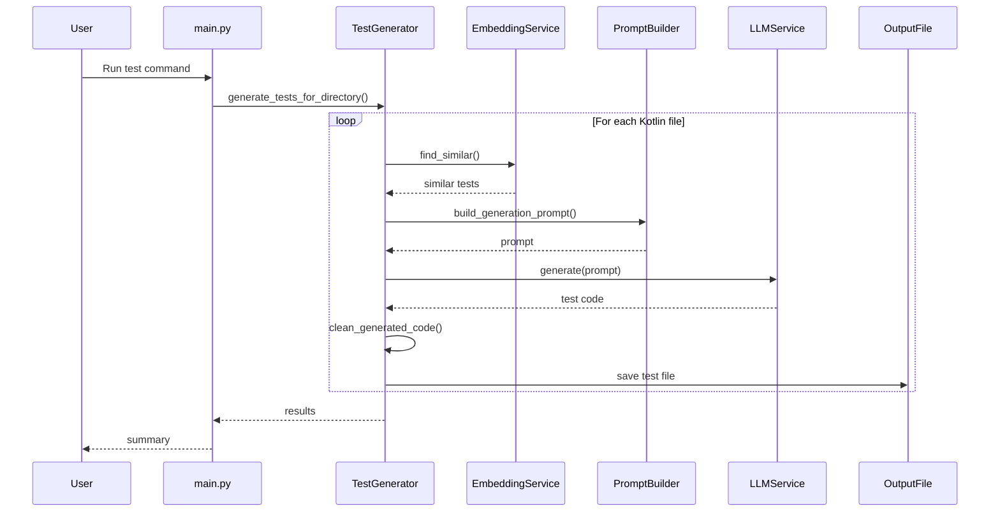
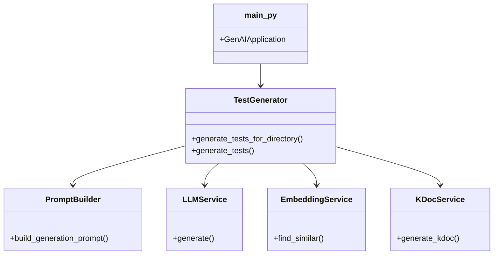

# AI-Powered Kotlin Test Generation System v2.0 - Visual Diagrams

This document contains Mermaid diagrams representing the new modular system architecture, component interactions, and data flow for the AI-powered Kotlin test generation system v2.0.

## Diagrams

## System Overview

## Data Flow

1. User runs CLI command.
2. Test generator parses source and finds similar tests.
3. Prompt builder constructs LLM prompt.
4. LLM service generates test code.
5. Test code is validated and saved.
6. Output files are written to disk.

## Sequence Diagram - Test Generation

## Component Relationships

---

*Last updated: July 2025. For more, see API and ARCHITECTURE docs.*
