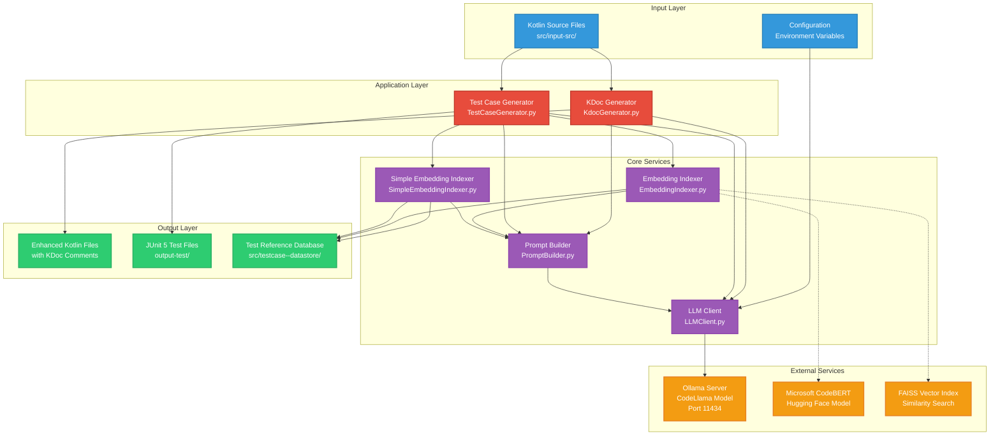
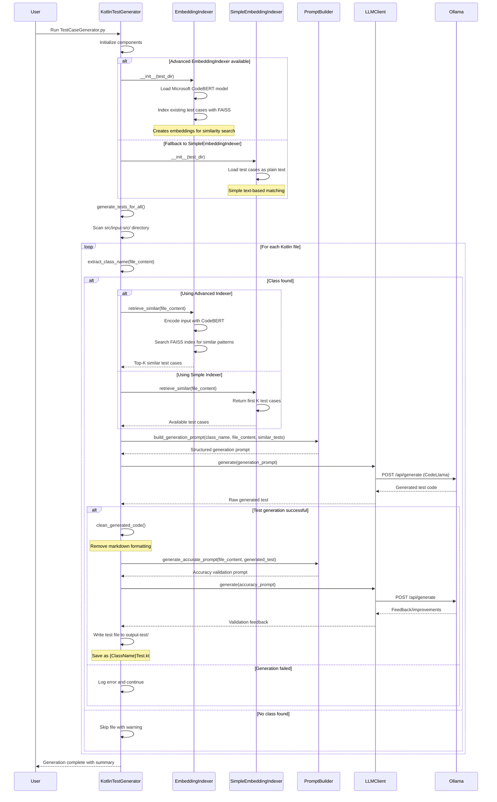
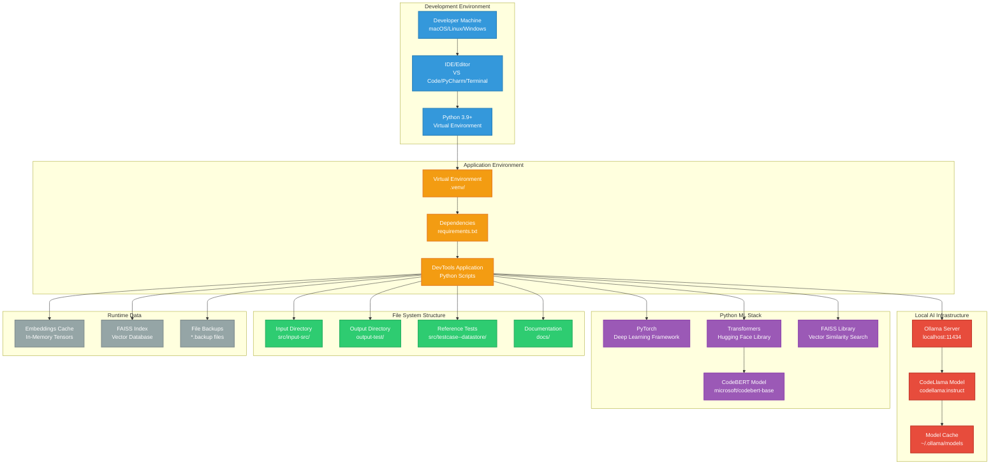

# AI-Powered Kotlin Test Generation System - Visual Diagrams

This document contains Mermaid diagrams representing the system architecture, component interactions, and data flow for the AI-powered Kotlin test generation system.

## System Architecture Overview



## Component Class Diagram

```mermaid
classDiagram
    class LLMClient {
        -api_url: str
        -model_name: str
        +__init__(api_url, model_name)
        +generate(prompt: str) str
    }

    class EmbeddingIndexer {
        -test_dir: str
        -tokenizer: AutoTokenizer
        -model: AutoModel
        -test_cases: List~str~
        -embeddings: torch.Tensor
        -index: faiss.IndexFlatL2
        -dimension: int
        +__init__(test_dir, embedding_model_name)
        +_load_and_index()
        +_encode(texts: List~str~) torch.Tensor
        +retrieve_similar(code: str, top_k: int) List~str~
    }

    class SimpleEmbeddingIndexer {
        -test_dir: str
        -test_cases: List~str~
        +__init__(test_dir)
        +_load_test_cases()
        +retrieve_similar(code: str, top_k: int) List~str~
    }

    class PromptBuilder {
        +build_generation_prompt(class_name, class_code, similar_tests) str
        +generate_accurate_prompt(class_code, generated_test) str
    }

    class KotlinTestGenerator {
        -source_dir: str
        -test_dir: str
        -llm_client: LLMClient
        -indexer: EmbeddingIndexer|SimpleEmbeddingIndexer
        +__init__(source_dir, test_dir, llm_client, indexer)
        +extract_class_name(code: str) Optional~str~
        +clean_generated_code(generated_code: str) str
        +process_file(filepath: str)
        +generate_tests_for_all()
    }

    class KdocGenerator {
        <<module>>
        +generate_kdoc_for_file(file_content: str) str
        +create_backup(filepath: str)
        +update_kdocs_in_file(filepath: str)
        +update_kdocs_in_directory(directory: str)
    }

    %% Relationships
    KotlinTestGenerator --> LLMClient : uses
    KotlinTestGenerator --> EmbeddingIndexer : uses (primary)
    KotlinTestGenerator --> SimpleEmbeddingIndexer : uses (fallback)
    KotlinTestGenerator --> PromptBuilder : uses
    EmbeddingIndexer --> "AutoTokenizer" : uses
    EmbeddingIndexer --> "AutoModel" : uses
    EmbeddingIndexer --> "faiss.IndexFlatL2" : uses
    KdocGenerator --> LLMClient : uses
    KdocGenerator --> PromptBuilder : uses
```

# Sequence Diagram - Test Generation Flow



# Updated Deployment Architecture



## Data Flow Architecture

```mermaid
graph LR
    subgraph "Input Processing"
        KT_FILES[Kotlin Files<br/>*.kt]
        CLASS_EXTRACT[Class Extraction<br/>Regex Pattern Matching]
        CONTENT_CLEAN[Content Cleaning<br/>Comment Removal]
    end

    subgraph "Similarity Analysis"
        ENCODE[Text Encoding<br/>CodeBERT Embeddings]
        VECTOR_SEARCH[Vector Search<br/>FAISS Index]
        CONTEXT_MATCH[Context Matching<br/>Top-K Similar Tests]
    end

    subgraph "AI Generation"
        PROMPT_BUILD[Prompt Construction<br/>Context + Instructions]
        LLM_CALL[LLM Generation<br/>Ollama + CodeLlama]
        CODE_CLEAN[Code Cleaning<br/>Markdown Removal]
    end

    subgraph "Quality Assurance"
        VALIDATION[Test Validation<br/>Accuracy Checking]
        FEEDBACK[Feedback Loop<br/>Improvement Suggestions]
        FINAL_CLEAN[Final Cleaning<br/>Format Standardization]
    end

    subgraph "Output Generation"
        FILE_WRITE[File Writing<br/>Test File Creation]
        BACKUP_CREATE[Backup Creation<br/>Safety Measures]
        LOGGING[Progress Logging<br/>Status Updates]
    end

    %% Data Flow
    KT_FILES --> CLASS_EXTRACT
    CLASS_EXTRACT --> CONTENT_CLEAN
    CONTENT_CLEAN --> ENCODE
    ENCODE --> VECTOR_SEARCH
    VECTOR_SEARCH --> CONTEXT_MATCH
    CONTEXT_MATCH --> PROMPT_BUILD
    PROMPT_BUILD --> LLM_CALL
    LLM_CALL --> CODE_CLEAN
    CODE_CLEAN --> VALIDATION
    VALIDATION --> FEEDBACK
    FEEDBACK --> FINAL_CLEAN
    FINAL_CLEAN --> FILE_WRITE
    FILE_WRITE --> BACKUP_CREATE
    BACKUP_CREATE --> LOGGING

    %% Styling
    classDef inputStyle fill:#3498db,stroke:#2980b9,stroke-width:2px,color:#fff
    classDef processStyle fill:#9b59b6,stroke:#8e44ad,stroke-width:2px,color:#fff
    classDef aiStyle fill:#e74c3c,stroke:#c0392b,stroke-width:2px,color:#fff
    classDef qaStyle fill:#f39c12,stroke:#e67e22,stroke-width:2px,color:#fff
    classDef outputStyle fill:#2ecc71,stroke:#27ae60,stroke-width:2px,color:#fff

    class KT_FILES,CLASS_EXTRACT,CONTENT_CLEAN inputStyle
    class ENCODE,VECTOR_SEARCH,CONTEXT_MATCH processStyle
    class PROMPT_BUILD,LLM_CALL,CODE_CLEAN aiStyle
    class VALIDATION,FEEDBACK,FINAL_CLEAN qaStyle
    class FILE_WRITE,BACKUP_CREATE,LOGGING outputStyle
```



---

*Last Updated: July 3, 2025*  
*These diagrams reflect the current implementation with Microsoft CodeBERT embedding support and fallback mechanisms.*
