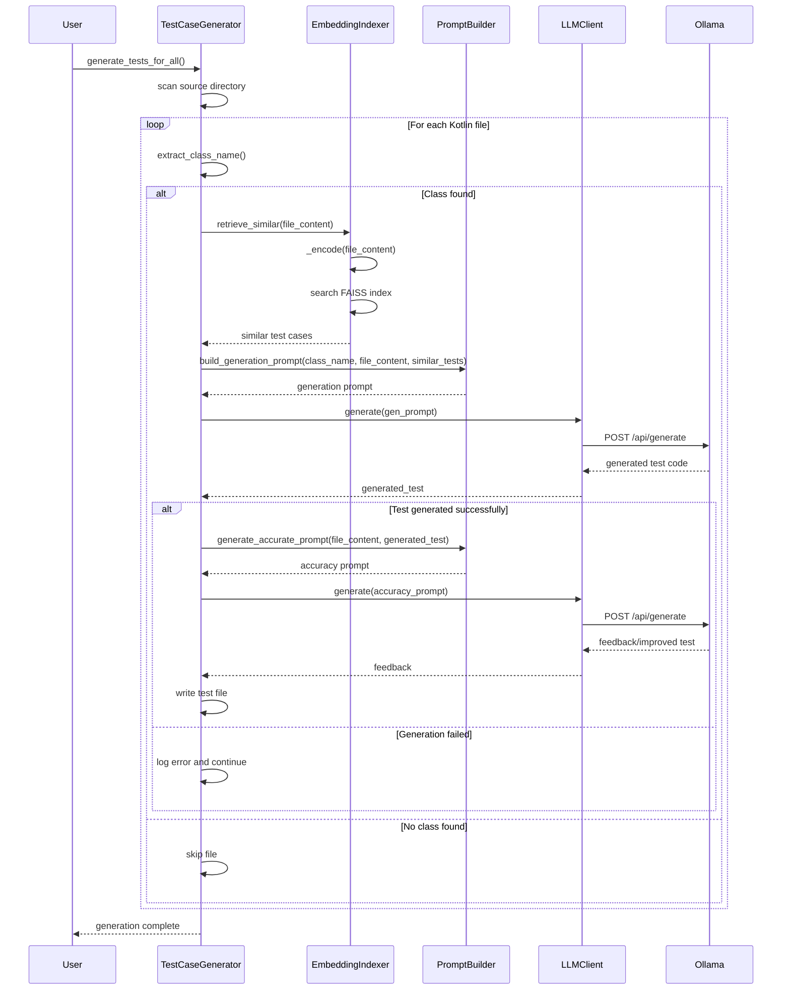
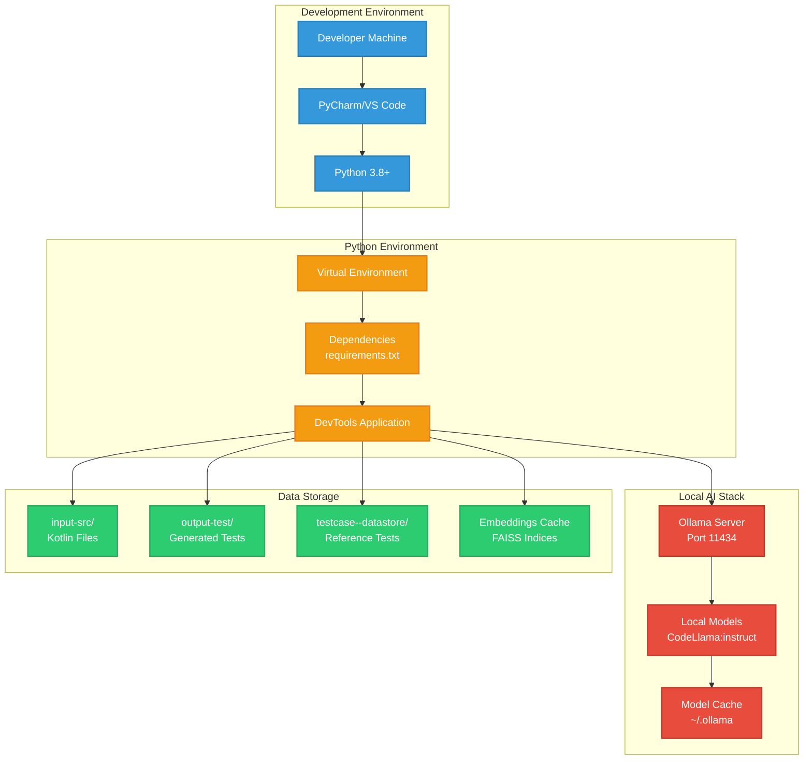

```mermaid
graph TB
    subgraph "Input Layer"
        KT[Kotlin Source Files<br/>(.kt)]
        CONFIG[Configuration<br/>Files]
    end

    subgraph "Application Layer"
        KDOC[KDoc Functions<br/>Kdoc.py]
        KDOCGEN[KDoc Functions<br/>KdocGenerator.py]
        TESTGEN[Test Case Generator<br/>TestCaseGenerator.py]
    end

    subgraph "Core Services"
        LLM[LLM Client<br/>LLMClient.py]
        EMBED[Embedding Indexer<br/>EmbeddingIndexer.py]
        PROMPT[Prompt Builder<br/>PromptBuilder.py]
    end

    subgraph "External Services"
        OLLAMA[Ollama<br/>CodeLlama Model]
        CODEBERT[CodeBERT<br/>Microsoft Model]
        FAISS[FAISS<br/>Vector Index]
    end

    subgraph "Output Layer"
        KDOCOUT[Enhanced Kotlin Files<br/>with KDoc]
        TESTOUT[JUnit 5 Test Files<br/>(.kt)]
        DATASTORE[Test Datastore<br/>testcase--datastore/]
    end

    %% Input connections
    KT --> KDOC
    KT --> KDOCGEN
    KT --> TESTGEN
    CONFIG --> LLM

    %% Application to Services
    KDOC --> LLM
    KDOC --> PROMPT
    KDOCGEN --> LLM
    KDOCGEN --> PROMPT
    TESTGEN --> LLM
    TESTGEN --> EMBED
    TESTGEN --> PROMPT

    %% Services to External
    LLM --> OLLAMA
    EMBED --> CODEBERT
    EMBED --> FAISS

    %% Cross-service communication
    EMBED --> PROMPT
    PROMPT --> LLM

    %% Output connections
    KDOC --> KDOCOUT
    KDOCGEN --> KDOCOUT
    TESTGEN --> TESTOUT
    TESTGEN --> DATASTORE
    EMBED --> DATASTORE

    %% Styling
    classDef inputStyle fill:#3498db,stroke:#2980b9,stroke-width:2px,color:#fff
    classDef appStyle fill:#e74c3c,stroke:#c0392b,stroke-width:2px,color:#fff
    classDef serviceStyle fill:#9b59b6,stroke:#8e44ad,stroke-width:2px,color:#fff
    classDef externalStyle fill:#f39c12,stroke:#e67e22,stroke-width:2px,color:#fff
    classDef outputStyle fill:#2ecc71,stroke:#27ae60,stroke-width:2px,color:#fff

    class KT,CONFIG inputStyle
    class KDOC,KDOCGEN,TESTGEN appStyle
    class LLM,EMBED,PROMPT serviceStyle
    class OLLAMA,CODEBERT,FAISS externalStyle
    class KDOCOUT,TESTOUT,DATASTORE outputStyle
```

# Class Diagram

```mermaid
classDiagram
    class LLMClient {
        -api_url: str
        -model_name: str
        +__init__(api_url, model_name)
        +generate(prompt: str) str
    }

    class EmbeddingIndexer {
        -test_dir: str
        -tokenizer: AutoTokenizer
        -model: AutoModel
        -test_cases: List~str~
        -embeddings: torch.Tensor
        -index: faiss.IndexFlatL2
        -dimension: int
        +__init__(test_dir, embedding_model_name)
        +_load_and_index()
        +_encode(texts: List~str~) torch.Tensor
        +retrieve_similar(code: str, top_k: int) List~str~
    }

    class PromptBuilder {
        +build_generation_prompt(class_name, class_code, similar_tests) str
        +generate_accurate_prompt(class_code, generated_test) str
    }

    class KotlinTestGenerator {
        -source_dir: str
        -test_dir: str
        -llm_client: LLMClient
        -indexer: EmbeddingIndexer
        +__init__(source_dir, test_dir, llm_client, indexer)
        +extract_class_name(code: str) Optional~str~
        +process_file(filepath: str)
        +generate_tests_for_all()
    }

    class KdocFunctions {
        <<module>>
        +generate_kdoc_for_file(file_content: str) str
        +update_kdocs_in_file(filepath: str)
        +update_kdocs_in_directory(directory: str)
    }

    %% Relationships
    KotlinTestGenerator --> LLMClient : uses
    KotlinTestGenerator --> EmbeddingIndexer : uses
    KotlinTestGenerator --> PromptBuilder : uses
    EmbeddingIndexer --> "AutoTokenizer" : uses
    EmbeddingIndexer --> "AutoModel" : uses
    EmbeddingIndexer --> "faiss.IndexFlatL2" : uses
    KdocFunctions --> LLMClient : uses
    KdocFunctions --> PromptBuilder : uses
```

# Sequence Diagram - Test Generation Flow



# Deployment Architecture


